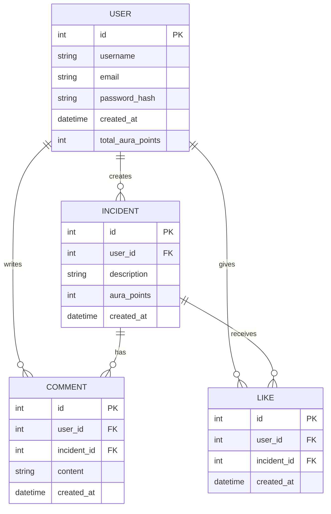

# Welcome to AURA
This application allows users to post their daily life incident and an AI will mark them with +ve or -ve points called **Aura points**.

User can see others' posts as well and can **like** or **comment** on them. Currently only these features are being developed but keeping the future in mind we intend to bring messaging, stories and much more to this new era of social media.

### ER Diagram

