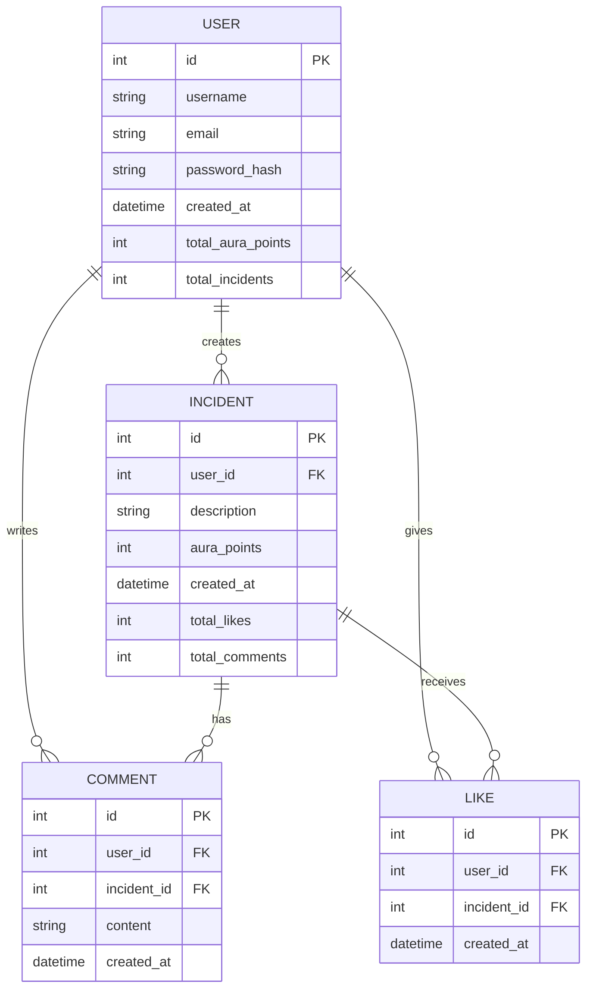

# Aura


## Table of Contents
- [Aura](#aura)
  - [Table of Contents](#table-of-contents)
  - [Introduction](#introduction)
  - [Features](#features)
  - [Tech Stack](#tech-stack)
  - [Getting Started](#getting-started)
    - [Prerequisites](#prerequisites)
    - [Installation](#installation)
  - [Project Structure](#project-structure)
  - [Usage](#usage)
  - [API Routes](#api-routes)
  - [Authentication](#authentication)
    - [Overview](#overview)
    - [Components](#components)
    - [Flow](#flow)
    - [API Routes](#api-routes-1)
    - [Example Code](#example-code)
      - [Registration](#registration)
      - [OTP Verification](#otp-verification)
      - [Login](#login)
  - [Database](#database)
    - [Overview](#overview-1)
    - [ER Diagram](#er-diagram)
    - [Supabase](#supabase)
      - [Usage](#usage-1)
      - [Example Code](#example-code-1)
    - [Redis](#redis)
      - [Usage](#usage-2)
      - [Example Code](#example-code-2)
      - [Caching Incident Data:](#caching-incident-data)
    - [Local Storage](#local-storage)
      - [Usage](#usage-3)
      - [Example Code](#example-code-3)
      - [Caching Incident Data:](#caching-incident-data-1)
  - [Contributing](#contributing)

## Introduction
Aura is a social media website where you can post about your daily life incidents and our AI will do awesome calculations to give that particular some `aura points`. You can track your **total aura** and see your friends too. Each **incident** is assigned an **aura** value based on its sentiment, creating a unique way for users to visualize and understand their daily experiences.

## Features

- User authentication (login, register, OTP verification)
- Create and share life incidents
- AI-powered sentiment analysis for Aura Points
- Upvote and downvote system for incidents
- Responsive design for mobile and desktop
- Real-time updates using optimistic UI
- Infinite scroll for incident feed
- Dark mode UI

## Tech Stack

- Frontend:
  - Next.js (App Router)
  - React
  - Tailwind CSS
  - Framer Motion
  - ShadCN UI Components
- Backend:
  - Next.js API Routes
  - Supabase (PostgreSQL)
  - Redis (for caching)
- Authentication:
  - Custom JWT-based auth system
- State Management:
  - React Hooks
  - Context API
- Deployment:
  - Vercel

## Getting Started

### Prerequisites

- Node.js (v14 or later)
- npm or yarn
- Supabase account
- Redis account

### Installation

1. Clone the repository
```bash
git clone https://github.com/yourusername/aura-io.git
cd aura-io
```
2. Install dependencies
```bash
npm install
```
or
```bash
yarn install
```
3. Set up environment variables:
Create a `.env.local` file in the root directory and add the following variables:
`NEXT_PUBLIC_SUPABASE_URL=your_supabase_url`
`NEXT_PUBLIC_SUPABASE_ANON_KEY=your_supabase_anon_key`
`JWT_SECRET=your_jwt_secret`
`EMAIL_ADDRESS = your_email_address_from_which_otp_will_be_sent`
`EMAIL_PASSWORD = your_email_app_password` [[Help]](https://support.google.com/mail/answer/185833?hl=en)
`REDIS_PW = your_redis_database_password`
`REDIS_HOST = your_redis_host_address`
`REDIS_PORT = your_redis_port`
`HUGGING_FACE_API_TOKEN = your_hugging_face_api_token`

4. Run the development server
```bash
npm run dev
```
or
```bash
yarn dev
```
5. Open [http://localhost:3000](http://localhost:3000) in your browser to see the application.

## Project Structure

src/
├── app/
│   ├── api/
│   │   └── ...
│   ├── home/
│   │   └── page.js
│   ├── incidents/
│   │   └── page.js
│   ├── (auth)/
│   │   ├── login/
│   │   │   └── page.js
│   │   ├── register/
│   │   │   └── page.js
│   │   └── verifyOtp/
│   │       └── page.js
│   ├── profile/
│   │   └── page.js
│   ├── layout.js
│   └── page.js
├── components/
│   ├── common/
│   │   ├── AuraLoader.js
│   │   ├── Header.js
│   │   └── SideMenu.js
│   ├── homePage/
│   │   ├── AuraPointsAnimation.js
│   │   └── PostLoader.js
│   ├── profile/
│   │   └── ProfileLoadingScreen.js
│   └── ui/
│       └── ...
├── lib/
│   ├── db.js
│   ├── fetchUserData.js
│   ├── supabaseClient.js
│   └── utils.js
├── public/
│   └── ...
├── styles/
│   └── globals.css
├── tests/
│   └── db/
│       └── test-db.js
├── utils/
│   ├── auth.js
│   ├── capitalizeWords.js
│   ├── changeDateToReadable.js
│   └── voteHandler.js
├── .env.local
├── .eslintrc.json
├── .gitignore
├── aura-application-er-diagram.mermaid
├── components.json
├── docker-compose.yml
├── jsconfig.json
├── next.config.mjs
├── postcss.config.mjs
├── package.json
├── README.md
└── tailwind.config.cjs

## Usage
1. Register a new account or log in to an existing one.
2. On the home page, you can view incidents shared by other users.
3. Click the `Add New Incident` button to share your own life incident.
4. The AI will analyze your incident and assign Aura Points.
5. You can **upvote** or **downvote** incidents.
6. Visit your profile page to see your top aura moments and track your emotional journey.
7. Visit your incidents page to see all your incidents.

## API Routes
- `/api/auth/register`: Register a new user
- `/api/auth/login`: Log in a user
- `/api/auth/verification/verifyOtp`: Verify OTP for email confirmation
- `/api/user/homePage`: Get incidents for the home page feed
- `/api/user/incidents/sentiment`: Analyze sentiment of a new incident
- `/api/user/incidents/write-incident`: Create a new incident
- `/api/user/vote`: Handle upvotes and downvotes
- `/api/user/incidents/getIncidents`: Get a user's incidents for their profile

## Authentication

### Overview

The authentication system in Aura is designed to handle user registration, login, and OTP verification. It uses a custom JWT-based authentication system to manage user sessions securely.

### Components

1. **Registration**: Users can register by providing their email and password. An OTP is sent to their email for verification.
2. **Login**: Users can log in using their email and password. Upon successful login, a JWT token is generated and stored.
3. **OTP Verification**: Users verify their email by entering the OTP sent to their email during registration.

### Flow

1. **User Registration**
   - Endpoint: `/api/auth/register`
   - The user submits their email and password.
   - The server creates a new user record in the database and sends an OTP to the user's email.
   - The user is prompted to enter the OTP for verification.

2. **OTP Verification**
   - Endpoint: `/api/auth/verification/verifyOtp`
   - The user submits the OTP received via email.
   - The server verifies the OTP and activates the user's account.

3. **User Login**
   - Endpoint: `/api/auth/login`
   - The user submits their email and password.
   - The server verifies the credentials and generates a JWT token.
   - The JWT token is sent to the client and stored (e.g., in local storage or cookies).

4. **Protected Routes**
   - The client includes the JWT token in the Authorization header for requests to protected routes.
   - The server verifies the JWT token before granting access to protected resources.

### API Routes

- **Register**: `POST /api/auth/register`
  - Request Body: `{ "email": "user@example.com", "password": "password123" }`
  - Response: `{ "message": "OTP sent to your email" }`

- **Verify OTP**: `POST /api/auth/verification/verifyOtp`
  - Request Body: `{ "email": "user@example.com", "otp": "123456" }`
  - Response: `{ "message": "Email verified successfully" }`

- **Login**: `POST /api/auth/login`
  - Request Body: `{ "email": "user@example.com", "password": "password123" }`
  - Response: `{ "token": "jwt_token_here" }`

### Example Code

#### Registration

```javascript
// filepath: /src/app/api/auth/register/route.js
import { supabase } from '@/lib/supabaseClient';

export async function POST(request) {
  const { email, password } = await request.json();
  const { data, error } = await supabase.auth.signUp({ email, password });

  if (error) {
    return new Response(JSON.stringify({ error: error.message }), { status: 400 });
  }

  // Send OTP to user's email (implementation not shown)
  await sendOtpToEmail(email);

  return new Response(JSON.stringify({ message: 'OTP sent to your email' }), { status: 200 });
}
```

#### OTP Verification
```javascript
// filepath: /src/app/api/auth/verification/verifyOtp/route.js
import { supabase } from '@/lib/supabaseClient';

export async function POST(request) {
  const { email, otp } = await request.json();
  const { data, error } = await supabase.auth.verifyOtp({ email, otp });

  if (error) {
    return new Response(JSON.stringify({ error: error.message }), { status: 400 });
  }

  return new Response(JSON.stringify({ message: 'Email verified successfully' }), { status: 200 });
}
```

#### Login
```javascript
// filepath: /src/app/api/auth/login/route.js
import { supabase } from '@/lib/supabaseClient';
import jwt from 'jsonwebtoken';

export async function POST(request) {
  const { email, password } = await request.json();
  const { data, error } = await supabase.auth.signIn({ email, password });

  if (error) {
    return new Response(JSON.stringify({ error: error.message }), { status: 400 });
  }

  const token = jwt.sign({ userId: data.user.id }, process.env.JWT_SECRET, { expiresIn: '1h' });

  return new Response(JSON.stringify({ token }), { status: 200 });
}
```
## Database

### Overview

Aura uses a combination of Supabase, Redis, and local storage to manage and store data. Each of these technologies serves a specific purpose in the application:

- **Supabase**: Acts as the primary database and authentication provider.
- **Redis**: Used for caching to improve performance and reduce database load.
- **Local Storage**: Used to store user session data on the client side.

### ER Diagram


### Supabase

Supabase is an open-source Firebase alternative that provides a Postgres database, authentication, and real-time capabilities.

#### Usage

1. **User Authentication**:
   - Supabase handles user registration, login, and OTP verification.
   - User data is stored in the `users` table.

2. **Incident Management**:
   - Incidents are stored in the `incidents` table.
   - Each incident has associated `aura_points`, `user_id`, and other metadata.

3. **Votes and Comments**:
   - Votes are stored in the `incident_votes` table.
   - Comments are stored in the `incident_comments` table.

#### Example Code

**Fetching Incidents**:
```javascript
// filepath: /src/app/api/user/homePage/route.js
import { supabase } from '@/lib/supabaseClient';

export async function getIncidents(page) {
  const { data, error } = await supabase
    .from('incidents')
    .select('*')
    .range((page - 1) * 10, page * 10 - 1);

  if (error) {
    throw new Error('Error fetching incidents');
  }

  return data;
}
```

### Redis
Redis is an in-memory data structure store used for caching to improve performance and reduce the load on the primary database.

#### Usage
1. **Caching Incident Data**:
   - Frequently accessed incident data is cached in Redis to reduce the number of database queries.
   - Cached data is updated whenever an incident is created, updated, or deleted.
2. **Session management**:
    - User session data can be cached in Redis to improve authentication performance.

#### Example Code

#### Caching Incident Data:
```javascript
import Redis from 'ioredis';

const redis = new Redis(process.env.REDIS_URL);

export async function cacheIncidentData(incidentId, data) {
  await redis.set(`incident:${incidentId}`, JSON.stringify(data), 'EX', 3600); // Cache for 1 hour
}

export async function getCachedIncidentData(incidentId) {
  const data = await redis.get(`incident:${incidentId}`);
  return data ? JSON.parse(data) : null;
}
```

### Local Storage
Local storage is used to store user session data on the client side. This allows the application to persist user sessions across page reloads.

#### Usage
1. **Storing JWT Tokens**:
   - JWT tokens are stored in local storage after user login.
   - The token is used to authenticate requests to protected API routes.

#### Example Code

#### Caching Incident Data:
```javascript
export function storeToken(token) {
  localStorage.setItem('authToken', token);
}

export function getToken() {
  return localStorage.getItem('authToken');
}

export function removeToken() {
  localStorage.removeItem('authToken');
}
```

## Contributing

We welcome contributions to Aura.io! Please follow these steps to contribute:

1. Fork the repository
2. Create a new branch: `git checkout -b feature/your-feature-name`
3. Make your changes and commit them: `git commit -m 'Add some feature'`
4. Push to the branch: `git push origin feature/your-feature-name`
5. Submit a pull request

Please make sure to update tests as appropriate and adhere to the existing coding style.